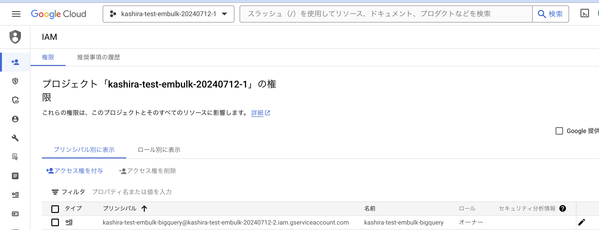
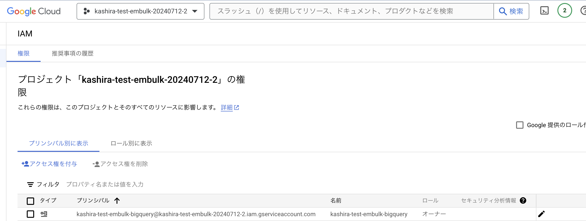

# examine-bug-for-embulk-bigquery
以下のPRの問題を再現した環境をGitに残すために利用する。

https://github.com/embulk/embulk-output-bigquery/pull/148

# GCP環境のセットアップ手順
プロジェクトを2つ作る。(sandboxではないプロジェクトを利用した)

それぞれのプロジェクトは以下の目的で利用する。(また今後は `project`, `destination_project` として呼ぶ)
- `kashira-test-embulk-20240712-1` を `project`
- `kashira-test-embulk-20240712-2` を `destination_project`


## データセットの作成

`destination_project` にのみ `test_embulk` データセットを作成する。


## サービスアカウントの作成
`destination_project`側に属するサービスアカウントを作成する。


鍵は、このリポジトリのcredential/に保存した。

## 権限を付与する
条件を揃えるために両方ownerで設定.




# 実行方法
setup
```
cd bundle
embulk bundle
```

実行(リポジトリ直下で)
```
embulk run load.yml -b ./bundle
```

# エラーログ
```
 ~/Documents/work/examine-bug-for-embulk-bigquery/ [main*] embulk run load.yml -b ./bundle

================================== [ NOTICE ] ==================================
 Embulk will not be executable as a single command, such as 'embulk run'.
 It will happen at some point in v0.11.*.

 Get ready for the removal by running Embulk with your own 'java' command line.
 Running Embulk with your own 'java' command line has already been available.

 For instance in Java 1.8 :
  java -XX:+AggressiveOpts -XX:+UseConcMarkSweepGC -jar embulk-X.Y.Z.jar run ...
  java -XX:+AggressiveOpts -XX:+TieredCompilation -XX:TieredStopAtLevel=1 -Xverify:none -jar embulk-X.Y.Z.jar guess ...

 See https://github.com/embulk/embulk/issues/1496 for the details.
================================================================================

2024-07-12 16:24:03.618 +0900 [INFO] (main): embulk_home is set by the location of embulk.properties found in: /Users/kashira/.embulk
2024-07-12 16:24:03.621 +0900 [INFO] (main): m2_repo is set as a sub directory of embulk_home: /Users/kashira/.embulk/lib/m2/repository
2024-07-12 16:24:03.621 +0900 [INFO] (main): gem_home is set as a sub directory of embulk_home: /Users/kashira/.embulk/lib/gems
2024-07-12 16:24:03.622 +0900 [INFO] (main): gem_path is set empty.
2024-07-12 16:24:03.622 +0900 [DEBUG] (main): Embulk system property "default_guess_plugin" is set to: "gzip,bzip2,json,csv"
2024-07-12 16:24:03.771 +0900 [INFO] (main): Started Embulk v0.11.1
2024-07-12 16:24:03.804 +0900 [INFO] (0001:transaction): Loaded plugin embulk-input-file
2024-07-12 16:24:05.677 +0900 [INFO] (0001:transaction): BUNDLE_GEMFILE is being set: "/Users/kashira/Documents/work/examine-bug-for-embulk-bigquery/./bundle/Gemfile"
2024-07-12 16:24:05.683 +0900 [INFO] (0001:transaction): Gem's home and path are being cleared.
2024-07-12 16:24:06.916 +0900 [INFO] (0001:transaction): Loaded JRuby runtime 9.4.8.0
/Users/kashira/Documents/work/examine-bug-for-embulk-bigquery/bundle/jruby/3.1.0/gems/googleauth-1.11.0/lib/googleauth/helpers/connection.rb:27: warning: attribute accessor as module_function
2024-07-12 16:24:09.111 +0900 [INFO] (0001:transaction): Loaded plugin embulk-output-bigquery (0.7.1)
2024-07-12 16:24:09.117 +0900 [INFO] (0001:transaction): Loaded plugin embulk-parser-csv
2024-07-12 16:24:09.209 +0900 [INFO] (0001:transaction): Listing local files at directory '.' filtering filename by prefix 'data.csv'
2024-07-12 16:24:09.210 +0900 [INFO] (0001:transaction): "follow_symlinks" is set false. Note that symbolic links to directories are skipped.
2024-07-12 16:24:09.215 +0900 [INFO] (0001:transaction): Loading files [data.csv]
2024-07-12 16:24:09.299 +0900 [INFO] (0001:transaction): Using local thread executor with max_threads=16 / output tasks 8 = input tasks 1 * 8
2024-07-12 16:24:09.327 +0900 [INFO] (0001:transaction): embulk-output-bigquery: Get dataset... kashira-test-embulk-20240712-2:test_embulk
2024-07-12 16:24:10.672 +0900 [INFO] (0001:transaction): embulk-output-bigquery: Create table... kashira-test-embulk-20240712-2:test_embulk.LOAD_TEMP_19b5b3fa_6a35_4990_90d4_a78d30659c00_test_data
2024-07-12 16:24:11.175 +0900 [ERROR] (0001:transaction): embulk-output-bigquery: insert_table(kashira-test-embulk-20240712-1, test_embulk, us/eu, {:table_reference=>{:table_id=>"LOAD_TEMP_19b5b3fa_6a35_4990_90d4_a78d30659c00_test_data"}, :description=>nil, :schema=>{:fields=>[{:name=>"id", :type=>"INTEGER"}, {:name=>"name", :type=>"STRING"}]}}, {}), response:{:status_code=>404, :message=>"notFound: Not found: Dataset kashira-test-embulk-20240712-1:test_embulk", :error_class=>Google::Apis::ClientError}
2024-07-12 16:24:11.188 +0900 [INFO] (0001:cleanup): Loaded plugin embulk-input-file
2024-07-12 16:24:12.821 +0900 [INFO] (0001:cleanup): BUNDLE_GEMFILE is being set: "/Users/kashira/Documents/work/examine-bug-for-embulk-bigquery/./bundle/Gemfile"
2024-07-12 16:24:12.823 +0900 [INFO] (0001:cleanup): Gem's home and path are being cleared.
2024-07-12 16:24:13.963 +0900 [INFO] (0001:cleanup): Loaded JRuby runtime 9.4.8.0
/Users/kashira/Documents/work/examine-bug-for-embulk-bigquery/bundle/jruby/3.1.0/gems/googleauth-1.11.0/lib/googleauth/helpers/connection.rb:27: warning: attribute accessor as module_function
2024-07-12 16:24:15.945 +0900 [INFO] (0001:cleanup): Loaded plugin embulk-output-bigquery (0.7.1)
org.embulk.exec.PartialExecutionException: org.jruby.exceptions.StandardError: (Error) failed to create table kashira-test-embulk-20240712-2:test_embulk.LOAD_TEMP_19b5b3fa_6a35_4990_90d4_a78d30659c00_test_data in us/eu, response:{:status_code=>404, :message=>"notFound: Not found: Dataset kashira-test-embulk-20240712-1:test_embulk", :error_class=>Google::Apis::ClientError}
        at org.embulk.exec.BulkLoader$LoaderState.buildPartialExecuteException(BulkLoader.java:340)
        at org.embulk.exec.BulkLoader.doRun(BulkLoader.java:580)
        at org.embulk.exec.BulkLoader.access$000(BulkLoader.java:36)
        at org.embulk.exec.BulkLoader$1.run(BulkLoader.java:353)
        at org.embulk.exec.BulkLoader$1.run(BulkLoader.java:350)
        at org.embulk.spi.ExecInternal.doWith(ExecInternal.java:26)
        at org.embulk.exec.BulkLoader.run(BulkLoader.java:350)
        at org.embulk.EmbulkEmbed.run(EmbulkEmbed.java:278)
        at org.embulk.EmbulkRunner.runInternal(EmbulkRunner.java:288)
        at org.embulk.EmbulkRunner.run(EmbulkRunner.java:153)
        at org.embulk.cli.EmbulkRun.runInternal(EmbulkRun.java:108)
        at org.embulk.cli.EmbulkRun.run(EmbulkRun.java:24)
        at org.embulk.cli.Main.main(Main.java:53)
        Suppressed: java.lang.NullPointerException
                at org.embulk.exec.BulkLoader.doCleanup(BulkLoader.java:477)
                at org.embulk.exec.BulkLoader$3.run(BulkLoader.java:411)
                at org.embulk.exec.BulkLoader$3.run(BulkLoader.java:408)
                at org.embulk.spi.ExecInternal.doWith(ExecInternal.java:26)
                at org.embulk.exec.BulkLoader.cleanup(BulkLoader.java:408)
                at org.embulk.EmbulkEmbed.run(EmbulkEmbed.java:283)
                ... 5 more
Caused by: org.jruby.exceptions.StandardError: (Error) failed to create table kashira-test-embulk-20240712-2:test_embulk.LOAD_TEMP_19b5b3fa_6a35_4990_90d4_a78d30659c00_test_data in us/eu, response:{:status_code=>404, :message=>"notFound: Not found: Dataset kashira-test-embulk-20240712-1:test_embulk", :error_class=>Google::Apis::ClientError}
        at RUBY.create_table_if_not_exists(/Users/kashira/Documents/work/examine-bug-for-embulk-bigquery/bundle/jruby/3.1.0/gems/embulk-output-bigquery-0.7.1/lib/embulk/output/bigquery/bigquery_client.rb:462)
        at RUBY.auto_create(/Users/kashira/Documents/work/examine-bug-for-embulk-bigquery/bundle/jruby/3.1.0/gems/embulk-output-bigquery-0.7.1/lib/embulk/output/bigquery.rb:315)
        at RUBY.transaction(/Users/kashira/Documents/work/examine-bug-for-embulk-bigquery/bundle/jruby/3.1.0/gems/embulk-output-bigquery-0.7.1/lib/embulk/output/bigquery.rb:342)
        at RUBY.transaction(/Users/kashira/Documents/work/examine-bug-for-embulk-bigquery/bundle/jruby/3.1.0/gems/embulk-0.11.1-java/lib/embulk/output_plugin.rb:64)
Caused by: org.jruby.exceptions.StandardError: (ClientError) notFound: Not found: Dataset kashira-test-embulk-20240712-1:test_embulk
        at RUBY.check_status(/Users/kashira/Documents/work/examine-bug-for-embulk-bigquery/bundle/jruby/3.1.0/gems/google-apis-core-0.15.0/lib/google/apis/core/http_command.rb:244)
        at RUBY.check_status(/Users/kashira/Documents/work/examine-bug-for-embulk-bigquery/bundle/jruby/3.1.0/gems/google-apis-core-0.15.0/lib/google/apis/core/api_command.rb:135)
        at RUBY.process_response(/Users/kashira/Documents/work/examine-bug-for-embulk-bigquery/bundle/jruby/3.1.0/gems/google-apis-core-0.15.0/lib/google/apis/core/http_command.rb:207)
        at RUBY.execute_once(/Users/kashira/Documents/work/examine-bug-for-embulk-bigquery/bundle/jruby/3.1.0/gems/google-apis-core-0.15.0/lib/google/apis/core/http_command.rb:326)
        at RUBY.do_retry(/Users/kashira/Documents/work/examine-bug-for-embulk-bigquery/bundle/jruby/3.1.0/gems/google-apis-core-0.15.0/lib/google/apis/core/http_command.rb:131)
        at RUBY.retriable(/Users/kashira/Documents/work/examine-bug-for-embulk-bigquery/bundle/jruby/3.1.0/gems/retriable-3.1.2/lib/retriable.rb:61)
        at org.jruby.RubyFixnum.times(org/jruby/RubyFixnum.java:312)
        at RUBY.retriable(/Users/kashira/Documents/work/examine-bug-for-embulk-bigquery/bundle/jruby/3.1.0/gems/retriable-3.1.2/lib/retriable.rb:56)
        at RUBY.do_retry(/Users/kashira/Documents/work/examine-bug-for-embulk-bigquery/bundle/jruby/3.1.0/gems/google-apis-core-0.15.0/lib/google/apis/core/http_command.rb:128)
        at RUBY.retriable(/Users/kashira/Documents/work/examine-bug-for-embulk-bigquery/bundle/jruby/3.1.0/gems/retriable-3.1.2/lib/retriable.rb:61)
        at org.jruby.RubyFixnum.times(org/jruby/RubyFixnum.java:312)
        at RUBY.retriable(/Users/kashira/Documents/work/examine-bug-for-embulk-bigquery/bundle/jruby/3.1.0/gems/retriable-3.1.2/lib/retriable.rb:56)
        at RUBY.do_retry(/Users/kashira/Documents/work/examine-bug-for-embulk-bigquery/bundle/jruby/3.1.0/gems/google-apis-core-0.15.0/lib/google/apis/core/http_command.rb:118)
        at RUBY.execute(/Users/kashira/Documents/work/examine-bug-for-embulk-bigquery/bundle/jruby/3.1.0/gems/google-apis-core-0.15.0/lib/google/apis/core/http_command.rb:109)
        at RUBY.execute_or_queue_command(/Users/kashira/Documents/work/examine-bug-for-embulk-bigquery/bundle/jruby/3.1.0/gems/google-apis-core-0.15.0/lib/google/apis/core/base_service.rb:477)
        at RUBY.insert_table(/Users/kashira/Documents/work/examine-bug-for-embulk-bigquery/bundle/jruby/3.1.0/gems/google-apis-bigquery_v2-0.72.0/lib/google/apis/bigquery_v2/service.rb:1515)
        at RUBY.create_table_if_not_exists(/Users/kashira/Documents/work/examine-bug-for-embulk-bigquery/bundle/jruby/3.1.0/gems/embulk-output-bigquery-0.7.1/lib/embulk/output/bigquery/bigquery_client.rb:451)
        at RUBY.with_network_retry(/Users/kashira/Documents/work/examine-bug-for-embulk-bigquery/bundle/jruby/3.1.0/gems/embulk-output-bigquery-0.7.1/lib/embulk/output/bigquery/google_client.rb:51)
        at RUBY.create_table_if_not_exists(/Users/kashira/Documents/work/examine-bug-for-embulk-bigquery/bundle/jruby/3.1.0/gems/embulk-output-bigquery-0.7.1/lib/embulk/output/bigquery/bigquery_client.rb:451)
        ... 3 more

Error: org.jruby.exceptions.StandardError: (Error) failed to create table kashira-test-embulk-20240712-2:test_embulk.LOAD_TEMP_19b5b3fa_6a35_4990_90d4_a78d30659c00_test_data in us/eu, response:{:status_code=>404, :message=>"notFound: Not found: Dataset kashira-test-embulk-20240712-1:test_embulk", :error_class=>Google::Apis::ClientError}
```