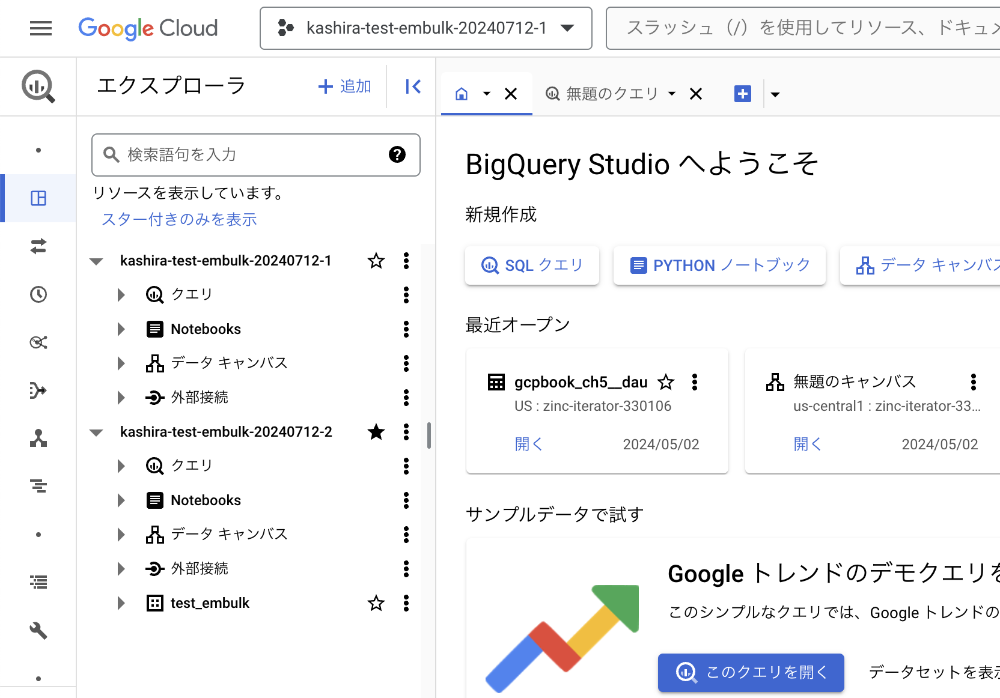
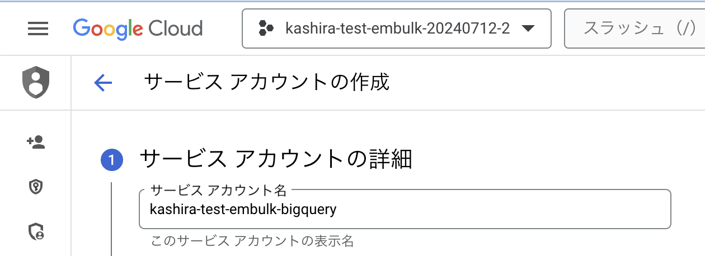
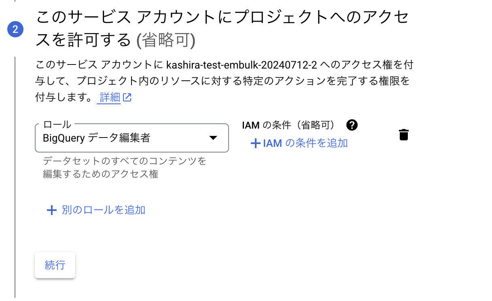

# examine-bug-for-embulk-bigquery
以下のPRの問題を再現した環境をGitに残すために利用する。

https://github.com/embulk/embulk-output-bigquery/pull/148

# GCP環境のセットアップ手順
プロジェクトを2つ作る。(sandboxではないプロジェクトを利用した)

それぞれのプロジェクトは以下の目的で利用する。(また今後は `project`, `destination_project` として呼ぶ)
- `kashira-test-embulk-20240712-1` を `project`
- `kashira-test-embulk-20240712-2` を `destination_project`


## データセットの作成

`destination_project` にのみ `test_embulk` データセットを作成する。


## サービスアカウントの作成
`destination_project`側に属するサービスアカウントを作成する。



鍵は、このリポジトリのcredential/に保存した。

# 実行方法
setup
```
cd bundle
embulk bundle
```

実行
```
embulk run load.yml -b ./bundle
```